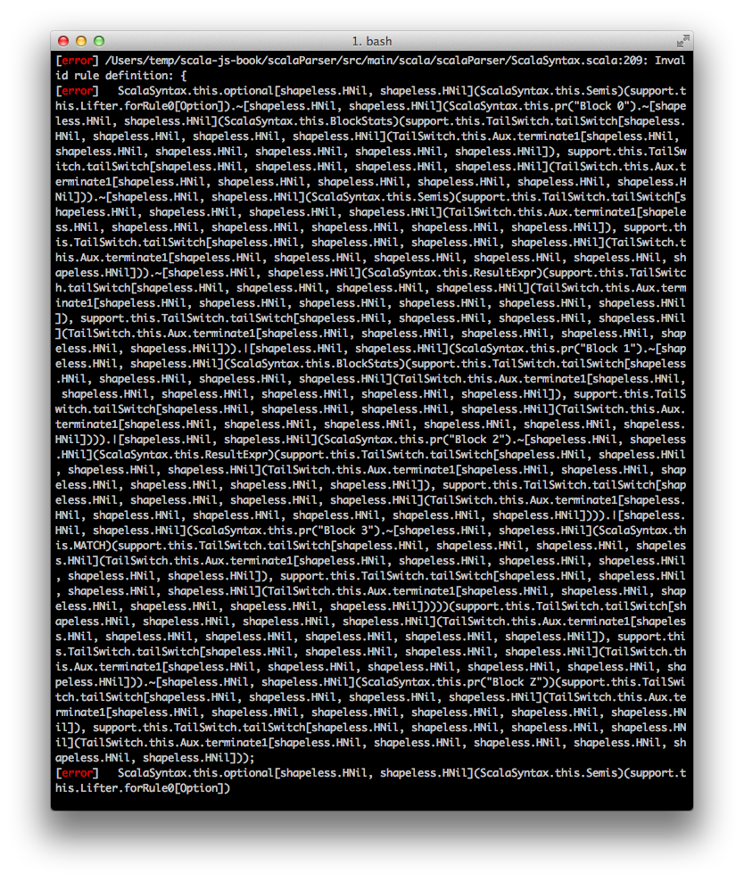

Про Parboiled
=============
**Часть 4. Суровая действительность**

В этой статье я расскажу о дополнительных возможностях, которые предоставляет Parboiled. Поделюсь скромным опытом
эксплуатации библиотеки в production системе. 
В этой статье я расскажу о неприятных моментах связанных с Parboiled. 

**Структура цикла:**

 - [Часть 1. Почему Parboiled?][part1]
 - [Часть 2. Сопоставление текста][part2]
 - [Часть 3. Извлечение данных][part3]
 - Часть 4. Суровая действительность

[part1]: http://habrahabr.ru/post/270233
[part1]: http://habrahabr.ru/post/270233
[part3]: TODO

<habracut>

## Отчеты об ошибках
Не думаю, что вам захочется работать с парсером, выдающем сообщение «Syntax error» при любых некорректных входных
данных. Parboiled2 способен вполне внятно рассказывать об ошибках, если вы ему в этом поможете.

### Форматирование
Итак, если что-то где-то навернулось, парсер передаст в ваше распоряжение объект типа `ParseError`, который можно
привести в читаемый вид посредством метода `formatError` *самого парсера*:

    val errorMessage = parser formatError error

Если дефолтное форматирование вас по каким-то причинам не устраивает, свои пожелания следует явным образом передать
передать парсеру в опционального параметра метода `formatError`:

    val errorMessage parser.formatError(error, new ErrorFormatter(showTraces = true))

Правда, если вы захотите написать свой `ErrorFormatter`, вам придётся самостоятельно разобраться со структурой
класса `ParseError`, который объявлен в глубине Parboiled таким образом:

    case class ParseError(position: Position, charCount: Int, traces: Seq[RuleTrace]) extends RuntimeException

Также стоит отметить наличие нескольких схем доставки сообщений об ошибке до заказчика: по вашему желанию `ParseError`
может быть представлен не только в виде объекта `Try`, а, например, в виде полиморфного типа или `Either`. Подробнее
можно ознакомиться [в ридми][deliv].

[deliv]: https://github.com/sirthias/parboiled2/blob/master/README.rst#alternative-deliveryschemes

    def Foo = rule { "foo" | fail("Я упаль!") }

### Тонкая настройка
Прежде всего, всегда есть опция, позволяющая обойти встроенный механизм формирования сообщений об ошибках. Для этого
всего-то нужно использовать правило `fail` с тем сообщением, с каким вы пожелаете:

    def Goldfinger = rule { "talk" | fail("to die") }

Тогда при удобном случае вы получите назад своё сообщение об ошибке, примерно в такой форме:

    `Invalid input 'Bond', expected to die. (line 1, column 1):`

### Именованные правила
Использование их бывает весьма полезным не только в целях отлова ошибок. Использование этого механизма описано ниже
в разделе «Best Practices».

### atomic
Parboiled2 создаёт парсер, построенный на PEG. Это означает что он работает на уровне символов, а не строк (как многие
могли подумать), поэтому и ошибки вам будут показываться на символьном уровне. Согласитесь, сообщение вида
«У вас тут X, мы ожидали Y или Z» потребует больше мысленных усилий, чем «У вас тут XX, а мы ожидали увидеть XY
или XZ». Для того, чтобы видеть строки в отчетах об ошибках целиком, придуман маркер `atomiс`, всего-то и нужно
обернуть в него правило:

    def AtomicRuleTest = rule { atomic("foo") | atomic("fob") | atomic("bar"beggyatwork) }

Чтобы при лисичках на входе получить

    Invalid input "fox", expected "foo", "fob" or "bar" (line 1, column 1):
    foxes
    ^

## quiet
Когда вариантов для выбора слишком много, не хочется показывать в сообщении об ошибке их все. Например в определенном
месте ваш парсер ожидает множество пробельных символов в совокупности с неким правилом. Для устранения избыточности
в отчете, вы, возможно, захотите умолчать о пробелах. С использованием маркера `quiet` это очень просто:

    def OptionalWhitespaces = rule { quiet(zeroOrMore(anyOf(" \t\n"))) }

Честно признаюсь, ситуаций, поощряющих использования этого правила, я не встречал. Так же, как и `atomic`, оно
подробно [описано в документации][doc-quiet].

[doc-quiet]: https://github.com/sirthias/parboiled2/blob/master/README.rst#the-quiet-marker

## Восстановление после ошибок
Это, практически, единственный эпизод, где Parboiled1 выигрывает. В PB2 дела обстоят не очень хорошо: парсер падает уже
только от вида первой же встреченной им ошибки. Для большинства сценариев это отлично подходит: это, например, не мешает
парсить конфигурационные файлы (не имеет смысла начинать работу с невалидным конфигом), однако разработчикам DSL или
IDE-подобных инструментов такое положение дел будет не по душе. [Маттиас обещает когда-нибудь это исправить][issue-42],
поэтому если вам эта фича очень сильно нужна уже сейчас — пните баг-трекер посильнее, вдруг это ускорит процесс
разработки.

[issue-42]: https://github.com/sirthias/parboiled2/issues/42

В Parboiled1 есть целая [куча ParserRunnerов][runners] на все случаи жизни, посмотрите в сторону
`RecoveringParserRunner`, если вам нужно продолжать парсинг в случае ошибок.

[runners]: https://github.com/sirthias/parboiled/wiki/Parse-Error-Handling

## Тестирование
Разработчики Parboiled используют для тестирования фреймворк [specs2][specs2], который они дополнили своим
вспомогательным классом [TestParserSpec][tps]. Он покажется неудобным тем, кто использует scalatest, но основную
его идею можно и перенять. По секрету от Матиаса, его решение не отличается особенной аккуратностью, так как
полагается на изменяемое соатояние. Возможно, в будущем нас будет ждать что-то похожее на полноценный каркас
для тестирования.

[specs2]: https://etorreborre.github.io/specs2/
[tps]:    ???

Правила можно тестировать как по отдельности, так и вместе. Лично я предпочитаю писать тесты не на каждое правило,
а проверять только главное правило в заковыристых случаях.

> **Кулстори:** Во многих форматах данные, даже стандартизованных, могут встречаться весьма интересные моменты.
> Например, в BSD-подобном формате сообщений [RFC 3164][rfc3164] под число месяца *всегда* отводится две позиции,
> даже если само число имеет один разряд. Вот пример из самого RFC:
>
> > If the day of the month is less than 10, then it MUST be represented as a space and then the number. For
> > example, the 7th day of August would be represented as `"Aug  7"`, with two spaces between the `"g"` and
> > the `"7"`.

[rfc3164]: https://www.ietf.org/rfc/rfc3164.txt

Помимо подобного рода «интересных моментов» можно скармливать правилу строки с незакрытыми скобками, недопустимыми
символами, проверять порядок операций со стеком значений.

В тестировании есть ещё одна тонкость, с которой вы сразу же столкнётесь. Предположим, вы хотите оттестировать
следуеющее правило:

    def Decimal = rule { ('+' | '-').? ~ Digit.+ ~ "." ~ Digit.+ }

Для этого скормим правилу заведомо некорректный ввод и будем ждать на выходе ошибку парсинга:

    // Я ещё не видел десятичных дробей с двумя разделителями.
    val p = new MyParser("12.3.456").Decimal.run()
    p.isFailure shouldBe true

Но при прогоне теста окажется, что парсер вернул удачный результат. Почему так? В нашем правиле нет `EOI`, но если если
мы добавим в него `EOI`, то испортим все правила, которые используют `Decimal`. Поэтому придётся создать специальное
тестирующее правило при помощи хитрого механизма [мета-правил][metaru]:

    def TestingDecimal = rule { Decimal ~ EOI }
    new MyTest("1.23.456").TestingDecimal.run().isFailure should be true

[metaru]: https://github.com/sirthias/parboiled2/blob/master/README.rst#advanced-techniques

## Goodies
Некоторые интересные вещи, которые поддерживаются Parboiled2
 - Разбор строк закодированных в Base64
 - Встраиваемый в парсер StringBuilder, с хэлперами для доступа
 - Возможность динамической диспетчеризации правил (DynamicRuleDispatch)
Есть еще один полезный класс, не затронутый в документации: [CharUtils](http://bit.ly/1NJJ2kd). Его использование,
возможно, упасет вас от написания собственного велосипеда.

## Недостатки Parboiled2
У любой, даже самой замечательной, библиотеки есть свои недостатки, и тут Parboiled2 не является исключением.

 - Длинные, слишком общие и совершенно непонятные сообщения компилятора об ошибках, в лучших традициях C++. Наглядный
   пример приведен на рисунке ниже (в правиле нечаянно пропущен оператор `~`). Причина связана с выполнением
   продвинутых проверок на типах, которые [обещают убрать][issue-106] в будущих версиях.

[issue-106]: https://github.com/sirthias/parboiled2/issues/106

 - Эта проблема относится больше не к Parboiled2, а к scalac. Компилятору сносит крышу, если у лямбды,
   захватывающей значения со стека, явно определены типы аргументов:

        // scalac: «Okay»
        def MyRule = rule { oneOrMore(Visible) ~> (s => "[" + s + "]") }

        // scalac: «No way!»
        def MyRule = rule { oneOrMore(Visible) ~> (s: String => "[" + s + "]") }

 - Многие IDE ещё не научились поддерживать макровыражения, а Parboiled2 весь построен на макровыражениях. Поэтому
   верить подчеркиваниям вашей среды разработки не стоит. Однажды я, забыв об этом, потратил целый день на поиск
   несуществующей ошибки буквально на ровном месте.

 - Отсутствие механизма восстанолвения при неудачном разборе. Проектирущих предметно-ориентированные языки, или же
   тех, кто хочет использовать Parboiled2 в качество фронтэнда к своему компилятору, это сильно разочарует. Но над этим
   уже [работают][issue-42].

[issue-42]: https://github.com/sirthias/parboiled2/issues/42

 - Я думаю, что многим разработчикам своих небольших IDE, текстовых редакторов хотелось бы видеть более гибкие сообщения
   об ошибках, чем те, что предоставляются сейчас. На данный [момент][issue-96] существует всего два способа повлиять
   на них:
    - именованные правила,
    - именованные вложенные правила.

[issue-96]: https://github.com/sirthias/parboiled2/issues/96

 - Parboiled не приспособлен к лево-рекурсивным грамматикам, поэтому вам придётся доработать вашу грамматику под
   Parboiled.
   
   

## Мне достался первый Parboiled
Большинство проектов всё ещё написаны на Parboiled1, и вряд-ли что-то изменится резко и кардинально (в энтерпрайзе),
поэтому может быть полезным знать, как научиться мириться с его недостатками.

### Ограничение на 7 правил
Parboiled1 построен так, что на каждое правило с N элементами имеется по классу, по аналогии со скаловскими кортежами
(tuples): есть `Rule0`, `Rule1`, вплоть до `Rule7`. Этого вполне достаточно, чтобы распарсить сложные языки
программирования, такие как Java, да и вообще не вызывает существенных проблем при разборе древовидных структур.
А вот если нужно извлечь данные из линейной структуры, например, сообщения лога-файла, то в это ограничение очень
несложно упереться. Решается это использованием кортежа вместо одного результирующего правила. Вот пример:

    def Event: Rule1[LogEvent] = rule {
      Header ~ " " ~ UserData ~ " " ~ Message ~~> {
        (header, data, message) => SyslogEvent (
          header._1, header._2, header._3, header._4, header._5, data._1, data._2, message
        )
      }
    }

Пусть выглядит убого, зато проблема решена.

## Миграция
Миграция — процесс, чаще всего, несложный, но занимает порядочно времени. Поэтмому я постараюсь хотя бы немного
сэкономить вам время и описать основные подводные камни.

### Classpath

Для того чтобы избежать конфликтов с первой версией, Parboiled2 использует classpath `org.parboiled2` (тогда
как classpath для первой версии `org.parboiled`). Мавеновский `groupId`, однако, остался старым: `org.parboiled`.
Благодаря этому можно иметь обе зависимости в одном проекте и осуществлять постепенный переход на новую версию.

### Проверка тестов
Убедитесь в наличии и работоспособности тестов. Они же у вас есть? Нет? Напишите их. В процессе миграции мне
приходилось уточнять некоторые грамматики из-за того, что новый DSL стал мощнее, и тесты при этом часто падали.
С серьезными проблемами, вроде поломки всей грамматики целиком, при миграции я не сталкивался. Может быть кто-то
поделится опытом, если с ним это произошло.

### Код вокруг парсера
Теперь, парсер будет пересоздаваться каждый раз, что не всегда удобно. С PB1 я очень любил создавать парсер один раз,
а потом многократно его переиспользовать, теперь же этот номер не пройдёт, поэтому вам придётся изменить конструктор
парсера и немного переписать использующий его код, и не бойтесь, что это ухудшит производительность.

Однако если вы использовали парсеры на сайдэффектах или генерировали их в рантайме динамически, вам, вероятно,
придётся помучиться: макровыражения в Parboiled2 больно бьют по динамике, давая взамен лучшую производительность.

### Композиция
Подход к композиции элементов парсера не изменился, это хорошая новость для миграторов. Однако `Parser` теперь не
трейт, а абстрактный класс. Трейты (traits) — удобнейшее средство композиции програмных компонентов, в PB1 это позволяло
подмешивать `Parser` в любые модули, смешивая модули между собой. Изменение в пользу абстрактного класса на эту
возможность никак принципиально не повлияло, но теперь для этого нужно использовать self-typed reference:

    trait Numbers { this: Parser =>
      // your code
    }

Также потребуется устранить лишние подмешивания парсера в подмодулях.

Как альтернативный вариант, вы можете сделать из ваших трейтов полноправные парсеры и импортировать из них нужные
правила (как методы) в ваш основной парсер. Я, правда, всё равно предпочитаю использовать для композиции трейты,
потому как нахожу их более наглядными.

### Ревизия велосипедов
В процессе миграции обязательно устройте ревизию своей личной библиотечки примитивных правил: после появления
таких стандартных классов, как `CharPredicate`, она должна заметно похудеть. Нет ничего приятнее, чем выкидывать
ставший ненужным код из проекта.

## Best practices
В этом разделе я раскажу о прописных истинах работающих для любого парсер комбинатора, а так же нюансах, специфичных для
Parboiled2.

### Пишите модульные тесты
Одно небольшое неудачное изменение может сломать вам грамматику и обеспечить острую ректальную боль. Это Банальный
совет, которым многие пренебрегают. Парсер не так сложно протестировать, как, скажем IO: Вам не нужны Mock-объекты и
другие ухищрения для этой рутинной, но очень ценной работы. У нас была целая инфраструктура парсеров. И поверьте, первое
что я делал при поиске ошибок - садился и писал тесты, в случае их отсутствия.

### Делайте парсеры маленькими (по возможности)
Разделяйте ваши парсеры, на подпарсеры. Каждый компонент должен делать что-то вполне определенное. Например если вы
парсите LogEvent, у которого опредено поле Timestamp (особенно если этот Timestamp соответствует какому-нибудь Rfc).
Не поленитесь и вынесите его отдельно.

  - Во-первых это уменьшит код вашего основного прасера, и сделает его нагляднее
  - Во-вторых это заметно облегчит тестирование. Вы покроете модульными тестами ваш сабпарсер. А после этого приступите
    к разработке главного парсера

Существуют разные подходы:

 - Разбивать парсер на трейты и использовать self-typed reference (предпочитаю этот способ).
 - Объявлять парсеры как самостоятельные сущности и использовать композицию.
 - Использовать встроенный механизм для создания subParsers

### Делайте правила маленькими
Правила должны быть максимально компактными, но не компактней. Чем меньше ваши правила, тем легче найти ошибку в
грамматике. Очень сложно понять логику разарботчика, если он делает правила длинными, и при этом, многократно
использует `capture`. Усугублять ситуацию может неявный захват.

### Отправляйте case objects вместо строк в Value stack
Данный совет можно отнести и к оптимизациям, Потому что заставляет парсер работать быстрее.
Отправляйте в Value stack значимые объекты, а не строки. Это сделает ваш парсер быстрее а код нагляднее.

Плохо:

    def logLevel = rule {
      capture("info" | "warning" | "error") ~ ':’
    }

Хорошо:

    def logLevel = rule {
        “info:”   ~ push(LogLevel.Info)
      | “warning" ~ push(LogLevel.Warning)
      | “error"   ~ push(LogLevel.Error)
    }

### Используйте упрощенный синтаксис для сборки объекта
Этот красивый способ появился еще в Parboiled1. Никакой магии, просот конструктор case classа вызывается неявно.
Главное, чтобы количество и тип аргументов помещаемых на Value Stack совпадали с сигнаторой конструктора case classа.

Плохо:

    def charsAST: Rule1[AST] = rule { capture(Characters) ~> ((s: String) => AText(s)) }

Хорошо:

    def charsAST = rule { capture(Characters) ~> AText }

### Именнованные правила (named rules)
Именованные правила заметно упрощают жизнь при получении отчетов об ошибках, так как дают возможность вместо
бестолкового имени правила использовать псевдоним. Или же помечать правила определенным тегом - "Йоу! Это выражение"
или "аффектит стек". В люобм случае знать о данной функции будет полезно.

Многие пользователи Parboiled1 уже полюбили эту фичу. Например разработчики Neo4J, использующие Parboiled для
разбора языка [Cypher](http://neo4j.com/docs/2.2.3/cypher-introduction.html).
Как это выглядит в Parboiled1:

    def Header: Rule1[Header] = rule("I am header") { ... }

В Parboiled2:

    def Header: Rule1[Header] = namedRule("header is here") { ... }

Так же есть возможность давать имена вложенным правилам:

    def UserName = rule { Prefix ~ oneOrMore(NameChar).named("username") ~ PostFix }

## Микроптимизации
Главное при выполнении оптимизаций — своевременность. Это то, с чем не принято спешить. Но если есть возможность сразу
написать чуть более оптимальный код, не особенно потеряв в выразительности — этой возможностью следует воспользоваться.

### Разворачивайте `n.times` для малых n <= 4
Вы можете выиграть в производительности, если для малых *n* вместо оператора повторения `n.times` просто соедините
в цепочку несколько повторяющихся правил. Сколько повторений имеет смысл разворачивать — зависит от обстоятельств, но
едва ли это число больше четырёх.

    // Не айс.
    rule { 4 times CharPredicate.Digit }

    // Айс.
    import CharPredicate.Digit
    rule { Digit ~ Digit ~ Digit ~ Digit }

Актуальность этой оптимизации [провозглашена][issue-101] самим Маттиасом, хотя, гипотетически, оператор `n.times` мог
бы и сам её выполнять.

[issue-101]: https://github.com/sirthias/parboiled2/issues/101

Кроме того, использование подобной техники позволит вам выжать немножко производительности и при из извлечении данных
со стека значений. Например, так можно применить её к предыдущему правилу:

    def Digit4 = rule {
      Digit ~ Digit ~ Digit ~ Digit ~
          push(#(charAt(-4))*1000 +
            #(charAt(-3))*100  +
           #(charAt(-2))*10   +
           #(lastChar))
    }

### Не пересоздавайте `CharPredicate` каждый раз
Совершенно нормально радоваться новым возможностям класса `CharPredicate`, однако создавать свои экземпляры типа
`CharPredicate` внутри блока `rule` совершенно не стоит: ваш предикат будет пересоздаваться каждый раз, когда
выполняется правило, что трагически испортит производительность вашего парсера. Поэтому не создавайте их каждый раз,
а определите единожды внутри вашего парсера как константу:

    class UselessParser(val input: ParserInput) extends Parser {
      val Uppercase = CharPredicate.from(_.isUpper)
      ...
    }

или, что ещё лучше, отправьте это объявление в объект-компаньон вашего парсера:

    class UselessParser(val input: ParserInput) extends Parser {
      ...
    }

    object UselessParser {
      val Uppercase = CharPredicate.from(_.isUpper)
    }

### Используйте семантические предикаты
Особенность данных правил в том что они не взаимодействую со стеком значений. Они подробно описаны в документации, но
вот самое главное, что вы должны о них знать:

> При использовании сематрических предикатов парсер не совершает прогресса, то есть не перемещает свой курсор на
> следующий символ. Поэтому при их бездумном использовании парсер может зациклиться.

Помните пример c объявлением символьного предиката для символов верхнего регистра? Вы можете сделать тоже
самое, используя семантический предикат `test`:

    def JavaUpperCase = rule { oneOrMore(test(currentChar.isUpper) ~ ANY) }

### Используйте `ANY` там, где хотели бы видеть `CharPredicate.All`
Увы, `CharPredicate.All` работает медленно для больших диапазонов символов, `ANY` работает быстрее. Воспользуйтесь
этим знанием.

### Используйте инвертирующий предикат
Представьте, что ваш парсер должен захватывать все символы до перевода строки (для определённости, в стиле Unix).
Конечно, это можно сделать при помощи `noneOf`, но инвертирующий предикат будет быстрее:

    // Не айс.
    def foo = rule { capture(zeroOrMore(noneOf("\n"))) }

    // Айс?
    def foo = rule { capture(zeroOrMore(!'\n')) }

К сожалению, этот замечательно выглядящий пример зациклит, потому что парсер не будет совершать прогресса. Чтобы это
исправить, необходимо правило, передвигающее курсор парсера, но при этом не изменяющее стек. Например, вот такое:

    // Айс!
    def foo = rule { capture(zeroOrMore( !'\n' ~ ANY )) }

Теперь правило `foo` поглотит абсолютно все, кроме `EOI` и перевода строки.

## Заключение
Спасибо что дочитали этот длиннопост до конца, или хотя бы пролистали. В этой статье я попытался рассказать вам про
самый прогрессивный и перспективный инструмент парсинга существующий для языка scala. Сделал небольшой туториал, и
рассказал о тех проблемах с какими пришлось столкнуться на практике. Надеюсь что что эта статья в худшем случае окажется
для вас полезной, а в лучшем - станет руководстком к действию.

## Использованные источники
 - [Список рассылки проекта Parboiled][mail-list]
 - [Презентация Александра Мыльцева][myltsev-presentation] и [слайды к ней][myltsev-slides]
 - [Примеры кода из репозитория Parboiled][pb-examples]
 - [Парсер языка scala, написаный при помощи Parboiled2][scala-parser]

[mail-list]:            https://groups.google.com/forum/#!topic/parboiled-user/Ygb_M6XU5P8
[myltsev-presentation]: http://www.youtube.com/watch?v=qZg4D62K4aQ
[myltsev-slides]:       http://myltsev.name/ScalaDays2014/#/
[pb-examples]:          http://bit.ly/1H2ZQ3A
[scala-parser]:         https://github.com/sirthias/parboiled2/tree/master/scalaParser/src

## Благодарности
